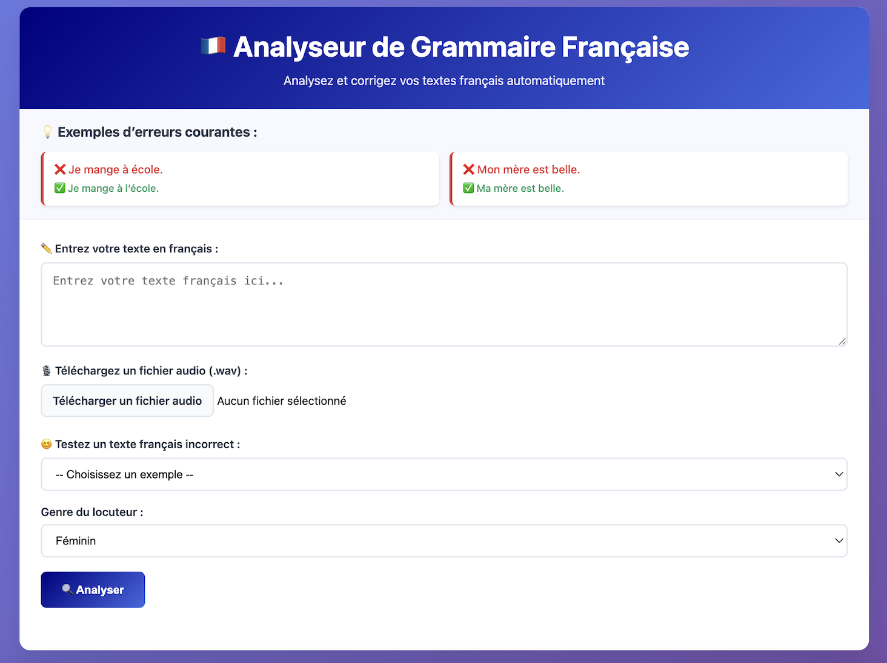

## Nuansa: The AI-Driven French Tutor
This is the official repository for Nuansa, a company focused on building AI-powered solutions for intermediate language learners. 
This respository contains our flagship product, an AI-Driven French Tutor, which is a personal AI tutor designed to help intermediate French learners achieve nuanced fluency.
The web application provides real-time, personalized feedback on both grammar and pronunciation, helping users get unstuck and accelerate their progress.

### Features
- Real-time Personalized Feedback: Provides instant, gender-aware grammar corrections (e.g., past participle agreement) and pronunciation analysis.
- Rule-Based Grammar Engine: Utilizes a custom system built on language_tool_python and tailored regex patterns for highly specific corrections, including proper diacritical mark usage.
- Dynamic Audio Integration:
  - Speech-to-Text (STT): Integrates OpenAI Whisper for accurate transcription of spoken French, with custom rules to correct phonetic misspellings.
  - Text-to-Speech (TTS): Generates natural-sounding, custom audio feedback in French using gTTS (Google Text-to-Speech).
- Intuitive User Interface: A simple web interface with an interactive error table that provides explainability for corrections, showing the error, a suggested fix, and the error type.

### Screenshots
#### Main Interface (Initial State)
This screenshot displays Nuansa's AI-driven French Tutor's main interface in its initial state, providing the core layout for user interaction. It includes the header, example errors, an empty text input field, audio upload options, and gender selection. 

#### Main Interface (Populated with Input)
This screenshot displays Nuansa's AI-driven French Tutor's main interface with user input, illustrating the app's readiness for analysis.

#### Feedback Interface (Results Display) 
After the user clicks the "Analyser" button, this section displays and dynamically extends the main interface to present the analysis results. It provides comprehensive feedback for both text input and uploaded audio files.

In this section:
- The "Transcription du texte français : " field shows the original input text (or transcribed audio after phonetic misspellings have been corrected).
- For **text input**, the app applies grammar corrections and diacritical mark corrections. It then generates custom audio feedback of the corrected sentence with integrated playback controls.
- For **audio input**, the app first performs Speech Recognition and Transcription (e.g., converting "Je suis aller à école" from `input.wav` to text). It then applies grammar corrections, diacritical mark corrections, and pronunciation corrections based on the original audio. Finally, it generates custom audio feedback of the corrected sentence with integrated playback controls.

This example shows text analysis of the sentence "Je suis aller chez mon mère" demonstrating the system's multi-layered error detection:
- Grammar Corrections: Detects errors such as incorrect past participle agreement ("aller" should be "allée" for feminine gender) and incorrect determiner agreement ("mon mère" should be "ma mère"), providing the corrected sentence.
- French Explanations: Provides detailed explanations in French for each grammatical correction.

### Files
- `nuansa-french-tutor/app/main.py`: Manages the Flask application, handling routes for the homepage and analysis requests while serving static files like audio feedback.
- `nuansa-french-tutor/app/templates/index.html`: Provides the user interface with input fields for text or audio, buttons to trigger analysis, and a section to display feedback results.
- `nuansa-french-tutor/app/uploads/input.wav`: A sample audio file containing example input.
- `nuansa-french-tutor/src/analyze.py`: Processes audio or text input using Whisper for transcription and language_tool_python for grammar checks, generating personalized audio feedback with gTTS.
- `nuansa-french-tutor/tests/test_language_tool.py`: Contains unit tests for grammar-checking functionality (using language_tool_python).
- `requirements.txt`: Lists all Python dependencies required to run the web app.

### Requirements
- Python 3.10 (required for compatibility with specific library versions, e.g., Whisper, as some libraries may have issues with the system default Python 3.13). Check your version with: `python3 --version`.
- An internet connection (required for gTTS to generate audio).
- flask==3.0.3 
- language-tool-python==2.9.3
- torch>=2.4.0
- transformers==4.44.2
- gTTS==2.5.3
- openai-whisper==20240930
- shap==0.46.0
- librosa==0.10.2
- scikit-learn==1.5.1
- numpy==1.26.4     
- plotly==5.24.0  
  
### Setup and Usage
#### Option 1: From GitHub (First Time Setup)
- **Note**: Start in your preferred directory (e.g., cd ~/Desktop/ or cd ~/Documents/). 
1. Clone the repository: `git clone https://github.com/mariahcoleno/nuansa-french-tutor.git`
2. Navigate to the project's repository root directory: `cd nuansa-french-tutor/`
3. Create a virtual environment: `python3.10 -m venv venv`
4. Activate the virtual environment: `source venv/bin/activate` # On Windows: venv\Scripts\activate
5. (Optional) Upgrade tools: pip install `--upgrade pip setuptools wheel` 
6. Install dependencies: `pip install -r requirements.txt`
   - If requirements.txt is missing, install manually: 
     `pip install flask==3.0.3 language-tool-python==2.9.3 torch>=2.4.0 transformers==4.44.2
      gTTS==2.5.3 openai-whisper==20240930 shap==0.46.0 librosa==0.10.2 scikit-learn==1.5.1 numpy==1.26.4 plotly==5.24.0`.
7. Proceed to "Run the App" below.

#### Option 2: Local Setup (Existing Repository)
1. Navigate to your local repository root (adjust path as needed): `cd ~/Documents/nuansa-french-tutor/`
2. Setup and activate a virtual environment:
   - If existing: `source venv/bin/activate` (adjust path if venv is elsewhere)
   - If new:
     - `python3.10 -m venv venv`
     - `source venv/bin/activate` # On Windows: venv\Scripts\activate
3. (Optional) Upgrade tools: pip install `--upgrade pip setuptools wheel` 
4. Install dependencies (if not already): `pip install -r requirements.txt` 
   - If requirements.txt is missing, use the manual install command above.
5. Proceed to "Run the App" below.

#### Run the App (Both Options):
1. `python3 -m app.main` 
   - Open your browser and navigate to http://127.0.0.1:5001.
   - Stop the app with Ctrl+C when done.
2. Use the interface:
   - Enter text (or select from the dropdown) and click "Analyze Text".
   - Upload a .wav file (click "Choose File", select the file, click "Open", then "Analyze Speech").
   - View the transcription, pronunciation corrections, and an error table with errors, suggestions, and explanations.
   - Listen to the audio feedback from a French speaker addressing corrected pronunciation and grammar.  

### Sample Data
- Je vais à le marché.
- Je suis aller chez mon mère.
- Elle mange un pomme. 
- `input.wav`: "Je suis aller a école."

### Project Structure
- nuansa-french-tutor/ (This is the top-level Git repository folder)
  - .gitignore 
  - README.md
  - requirements.txt
  - screenshots/ (Contains images for README) 
  - venv/ (Virtual environment)
  - nuansa-french-tutor/ (This is the main Python package/source code folder)
    - app/
      - static/
        - audio/ (multiple correction files)
      - templates
        - index.html
      - uploads/
        - input.wav
      - main.py
    - src/
      - __init__.py
      - analyze.py 
    - tests/
      - test_language_tool.py 

### Additional Notes
- The app runs on port 5001 to avoid common port conflicts and ensure faster startup. Access it at http://127.0.0.1:5001 after starting the server. 
If you encounter issues, check for port conflicts with lsof -i :5001 or run on a different port by modifying nuansa-french-tutor/app/main.py (e.g., change port=5001 to port=5002 and access http://127.0.0.1:5002).
- The `nuansa-french-tutor/app/uploads/` directory is created automatically to store temporary uploaded files and does not need to be versioned.

### License
- All rights reserved. Contact colenomariah92@gmail.com for licensing inquiries.

### Development Notes
- Application developed through iterative prompt engineering with AI tools (Claude/Grok/Gemini/ChatGPT) for rapid prototyping and learning.
- Images developed through iterative prompt engineeering with AI tools (ChatGPT) and GIMP.
 
