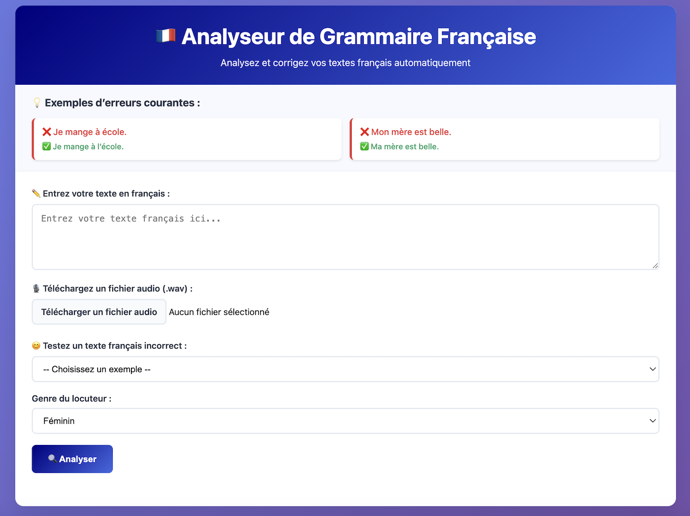
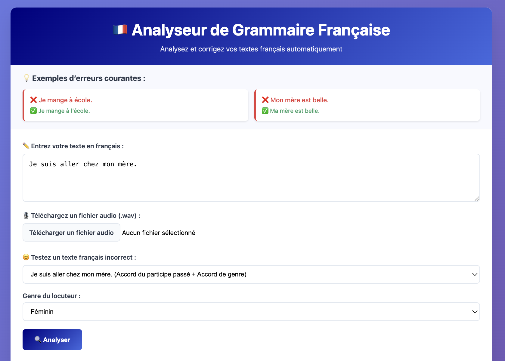
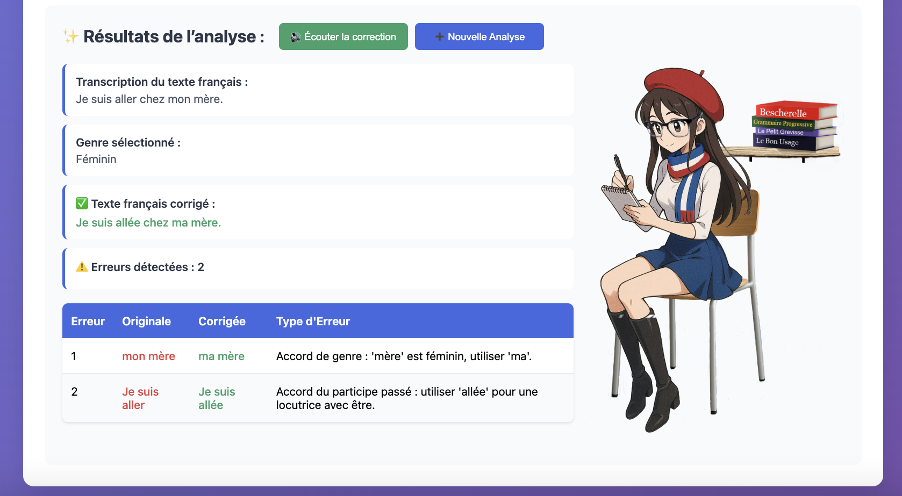

## French Learning Web App
This Flask-based web application is designed to help French learners improve their pronunciation, grammar, and proper use of French diacritical marks. 
It analyzes both text input and spoken French audio, identifies errors, and provides personalized feedback using AI-powered tools like Whisper and gTTS.

### Features
- Audio file transcription with Whisper for uploaded WAV files
- Detection of pronunciation and grammar errors, including proper diacritical mark usage (e.g., "a" to "à l'" before "école")
- Speech accent classification and analysis for pronunciation improvement
- Custom audio feedback in French, generated with gTTS
- Web interface for easy interaction
- Explainability via an error table in the UI, showing errors, suggested corrections, and error types 
- Gender-aware grammar corrections (e.g., past participle agreement for masculine or feminine gender)

### Screenshots
#### Main Interface
The French language learning web app's main interface provides feedback on pronunciation, grammar, and diacritical marks through text input and audio upload functionality, with gender selection for grammar agreement analysis.

#### French Text Analysis: Grammar Corrections
This French language learning web app provides comprehensive feedback from text input. 
The example shows analysis of the sentence "Je suis aller chez mon mère" demonstrating the system's multi-layered error detection:
- Grammar Corrections: Detects errors such as incorrect past participle agreement ("aller" should be "allée" for feminine gender) and incorrect determiner agreement ("mon mère" should be "ma mère"), providing the corrected sentence.
- French Explanations: Provides detailed explanations in French for each grammatical correction.

#### French Audio Analysis: Grammar Corrections, Pronunciation Corrections, and Accent Detection
This French language learning web app provides comprehensive feedback from uploaded audio files.
The example shows analysis of the sentence "Je suis aller à école" demonstrating the system's multi-layered error detection:
- Speech Recognition & Transcription: Converts uploaded audio (test.wav) to text, capturing the original spoken sentence.   
- Pronunciation Analysis: Identifies specific mispronunciations - "aller" spoken as "alair," "école" as "ecolay," and incorrect "J" pronunciation.
- Grammar Corrections: Detects liaison errors ("a" should be "à l'" before vowel sounds) and past participle agreement issues ("aller" should be "allé").
- French Explanations: Provides detailed explanations in French for each grammatical correction.
- Audio Feedback: Generates French audio explanations of detected errors with integrated playback controls.
- Accent Classification: Analyzes speech patterns to identify the speaker's accent (shown as "Unknown" in this example).

### Files
- `src/analyze.py`: Processes audio or text input using Whisper for transcription and language_tool_python for grammar checks, generating personalized audio feedback with gTTS.
- `app/main.py`: Manages the Flask application, handling routes for the homepage and analysis requests while serving static files like audio feedback.
- `app/templates/index.html`: Provides the user interface with input fields for text or audio, buttons to trigger analysis, and a section to display feedback results.
- `tests/test_language_tool.py`: Contains unit tests for grammar-checking functionality (using language_tool_python).
- `requirements.txt`: Lists all Python dependencies required to run the web app.
- `test.wav`: A sample audio file containing example input.

### Requirements
- Python 3.10 (required for compatibility with specific library versions, e.g., Whisper, as some libraries may have issues with the system default Python 3.13). Check your version with: `python3 --version`.
- An internet connection (required for gTTS to generate audio).
- flask==3.0.3 
- language-tool-python==2.9.3
- torch>=2.4.0
- transformers==4.44.2
- gTTS==2.5.3
- openai-whisper==20240930
- shap==0.46.0
- librosa==0.10.2
- scikit-learn==1.5.1
- numpy==1.26.4     
- plotly==5.24.0  
  
### Setup and Usage
#### Option 1: From GitHub (First Time Setup)
- **Note**
  - Start in your preferred directory (e.g., cd ~/Desktop/ or cd ~/Documents/). 
1. Clone the repository: `git clone https://github.com/mariahcoleno/french-language-learning-platform.git`
2. Navigate to the project directory: `cd french_learning_web_app/`
3. Create a virtual environment: `python3.10 -m venv venv`
4. Activate the virtual environment: `source venv/bin/activate` # On Windows: venv\Scripts\activate
5. (Optional) Upgrade tools: pip install `--upgrade pip setuptools wheel` 
6. Install dependencies: `pip install -r requirements.txt`
   - If requirements.txt is missing, install manually: 
     `pip install flask==3.0.3 language-tool-python==2.9.3 torch>=2.4.0 transformers==4.44.2
      gTTS==2.5.3 openai-whisper==20240930 shap==0.46.0 librosa==0.10.2 scikit-learn==1.5.1 numpy==1.26.4 plotly==5.24.0`.
7. Proceed to "Run the App" below.

#### Option 2: Local Setup (Existing Repository)
1. Navigate to your local repository (adjust path as needed): `cd ~/Documents/french-language-learning-platform/french_learning_web_app/`
2. Setup and activate a virtual environment:
   - If existing: `source venv/bin/activate` (adjust path if venv is elsewhere)
   - If new:
     - `python3.10 -m venv venv`
     - `source venv/bin/activate` # On Windows: venv\Scripts\activate
3. (Optional) Upgrade tools: pip install `--upgrade pip setuptools wheel` 
4. Install dependencies (if not already): `pip install -r requirements.txt` 
   - If requirements.txt is missing, use the manual install command above.
5. Proceed to "Run the App" below.

#### Run the App (Both Options):
1. `python3 -m app.main` 
   - Open your browser and navigate to http://127.0.0.1:5001.
   - Stop the app with Ctrl+C when done.
2. Use the interface:
   - Enter text (or select from the dropdown) and click "Analyze Text".
   - Upload a .wav file (click "Choose File", select the file, click "Open", then "Analyze Speech").
   - View the transcription, pronunciation corrections, and an error table with errors, suggestions, and explanations.
   - Listen to the audio feedback from a French speaker addressing corrected pronunciation and grammar.  

### Sample Data
- Je vais à le marché.
- Je suis aller chez mon mère.
- Elle mange un pomme. 
- `test.wav`: "Je suis aller a école."
- `test2.wav`: "Nous sommes fatigues après la école."

### Project Structure
- french-language-learning-platform/
  - french_learning_web_app/
    - app/
      - static/
        - audio/ (multiple correction files)
      - templates
        - index.html
      - uploads/
        - input.wav
      - main.py
    - screenshots (multiple sample images)
    - src/
      - __init__.py
      - analyze.py 
    - tests/
      - test_language_tool.py 
    - README.md
    - requirements.txt
    - test.wav
    - test2.wav
  - .gitignore

### Additional Notes
- The app runs on port 5001 to avoid common port conflicts and ensure faster startup. Access it at http://127.0.0.1:5001 after starting the server. If you encounter issues, check for port conflicts with lsof -i :5001 or run on a different port by modifying app/main.py (e.g., change port=5001 to port=5002 and access http://127.0.0.1:5002).
- The `app/uploads/` directory is created automatically to store temporary uploaded files and does not need to be versioned.

### License
- All rights reserved. Contact colenomariah92@gmail.com for licensing inquiries.

### Development Notes
- Application developed through iterative prompt engineering with AI tools (Claude/Grok) for rapid prototyping and learning.
